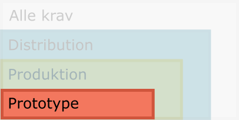

# Kategori: Prototype

{ align=right }

Som nævnt ovenfor, er eksempler på programmel i kategorien Prototype blandt
andet eksperimenter---herunder prototyper---, midlertidige opgaver og diverse
små-scripts.

## Versionsstyring

*   Alle filer relateret til koden (herunder test-kode, dokumentation,
    konfigurationsfiler og andet) er samlet og versionsstyret for at sikre, at
    filerne hænger sammen med hinanden på tværs af arkiv-versionerne.

> Bemærk, at der er forskel på en given version af arkivets indhold (i Git er
  det en SHA1-hash, der udgør et bidrags [*en.* commit] version) og den
  semantiske version af dét stykke programmel, der ligger i arkivet
  (eksempelvis version `1.2.3` for en pakke). Versionering af kodeudgivelser er
  ikke et krav i denne kategori, men se mere om dette under [**Produktion**](produktion.md).

### Git-arkivet

Et Git-arkiv har altid en `.git`-mappe som indeholder versionshistorikken. Ud
over denne, er der andre muligheder for at konfigurere versionsstyringen:

*   `.gitignore`-filen er vigtig af praktiske og sikkerhedsmæssige grunde.
    -   Arbejdet med koden og andre kildefiler producerer typisk en række
        sideprodukter så som Python-bytekode, test-cache-filer og andet, som
        altid kan produceres igen ud fra kildekoden. Filer som disse er derfor
        ikke nødvendige at versionsstyre.
    -   Andre filer kan være udviklerens egne konfigurationsfiler, som ikke bare
        er irrelevante, men også kan være sikekrhedsmæssigt uforsvarlige at
        komme til at knytte til arkivet: det kan være konfiurationsfiler med
        login-oplysninger.

*   `.gitattributes`
    -   Det kan være nødvendigt at definere nogle særlige atributter for nogle
        filtyper, så man kan lade Git håndtere dem éns på tværs af arkivets
        bidragydere. Det kan være markering af særlige filtyper som binære.
        Eller det kan være énsretning af linieskift-karakterer på tværs af
        operativsystemer.

> **Bemærk**
> 
> *   Din lokale og personlige `.gitconfig`-fil bør sættes op, inden du laver
>      ændringer.

### Git-arkiv på GitHub

GitHub er en Microsoft-ejet, online platform, som fungerer som en central
placering af vores Git-arkiver. Platformen yder flere ekstra ting, som gør det
lettere at administrere de enkelte arkiver, herunder at sammenflette versioner,
der kommer fra de enkelte bidragsydere til arkiverne.

*   Git-arkivets centrale version skal indtil videre ligge på GitHub.
*   **Start med at lave arkivet privat.**

## Programmel-kildekode

Kildekoden udgør programmellets egentlige funktionalitet. Programmellets
funktionalitet er forskellig fra alle de filer, mekanismer og andet i arkivet,
som bruges til at arbejde med koden
[installationsprogrammer, konfigurationsfiler, etc.]. Derfor placeres
kildekoden i en separat mappe adskilt fra andet, der ikke er nødvendigt, når
programmellet er installeret.

Mere konkret: er programmellet en samling forbundne scripts og moduler, så læg
dem i en mappe i arkivets rod kaldet `scripts`. Er det en Python-pakke, så læg
pakken i en mappe med navnet `src`.

## Konfigurationsfiler

Konfigurationsfiler kan dække flere formål:

*   Miljø-opsætning for udviklere eller brugere af koden.
    -   Eksempel: `environment.yml` til styring og installation af virtuelle
        Python miljøer med Mamba Forge-Python-distributionen.
    -   Eksempel: Indstillinger, der er nødvendige for, at koden kan udføre sine
        opgaver, eksempel login-oplysninger til en database eller andet. Da
        disse filer kan indeholde følsomme oplysninger, vil indstillingerne
        typisk være specielt-navngivne filer, der indikerer, at de er eksempler
        på en opsætning, man som bruger eller udvikler kan have.

## Dokumentation

### README-fil

I roden af arkivet skal der være en README-fil [kald den `README.md`, og lad
være med at oversætte filnavnet til dansk]. Dokumentet skal derfor indeholde
oplysninger om projektet, vejledninger, hjælp til at installere og komme igang,
samt kontakte arkivets nuværende udviklere.

På GitHub er dette dokument den første og dermed vigtigste indgang til
projektet, da filen automatisk bliver vist, når man tilgår arkivet. Sørg derfor
for som minimum at have en README-fil, og lad den have et basalt indhold.

Inspiration til indholdet af README-filen kan eventuelt hentes i følgende
[README-checkliste][ddbeck-checklist] ([tilhørende foredrag][ddbeck-yt]).

[ddbeck-checklist]: https://github.com/ddbeck/readme-checklist/blob/main/checklist.md

[ddbeck-yt]: https://www.youtube.com/watch?v=2dAK42B7qtw

### Licens

Licensen er en juridisk vejledning i, hvordan man må bruge programmellet, samt
hvilke rettigheder, man har som bruger af det.

*   Arkivet indeholder en beskrivelse af licens-betingelserne.

*   Anvend konventionen med en fil `LICENSE` i roden af Git-arkivet.
    -   [Eksempel](https://github.com/Sdfidk/template-python-prototype/blob/main/LICENSE)

*   Valg af licens: Som udgangspunkt anvender vi MIT-licensen, men overvej
    behovet.
    -   Læs eventuelt her om, hvorfor det er vigtigt at have valgt en licens,
        frem for ingenting: [Copy-left and Copy-right -- what you need to know][license]

[license]: https://ascl.net/wordpress/wp-content/uploads/2015/01/AAS_2015_VanderPlasUWashCopyrightleft.pdf

### Brugervejledning

*   Med tanke på modtagerne, skal der være en vejledning til brugeren, der skal
    anvende programmellet.

*   Brugeren skal vide, hvilket problem programmellet løser, og hvilken værdi
    det skaber. Dette kan være givet, men det er godt at have med.

*   Så skal brugeren vide, hvordan man kommer igang med at bruge programmellet.

*   Og så er det vigtigt, at brugeren bliver informeret om, hvorhen eller til
    hvem de kan gå for at få hjælp eller bidrage med feedback.

    -   Brugere (og udviklere) skal vide, hvordan man opretter sager, hvis man
        oplever fejl i programmellet eller har ændringsønsker. Samtidig lægger
        vi med al koden på GitHub op til, at man anvender platformen til at
        bidrage med ændringer, hvis man selv er i stand til at bidrage til
        projektet, om det så er kode eller dokumentation eller noget tredje.

### Installationsvejledning

*   Med tanke på modtagerne, skal der være relevante installationsvejledninger,
    som er relevante i forbindelse med udvikling og brug af programmellet.

*   Udviklere skal vide, hvad de skal installere for at kunne bygge videre på
    kode og dokumentation, herunder lokal testopsætning i deres egne miljøer.

    -   Man behøver ikke nødvendigvis en vejledning installation af teamets
        gængse værktøjer. Men tænkt i relevans her og overvej, igen, om en ny
        udvikler/kollega kan klare sig selv uden den konkrete vejledning.

*   Brugeren skal i arkivet kunne læse sig til, hvordan programmellet
    installeres, så det kan tages i brug som et færdigt produkt.

### Vedligeholdelsesvejledning

Som en del af fremtidssikringen, skal der i denne kategori som minimum være en
beskrivelse af, hvordan projektet fortsat kan vedligeholdes til fremtidigt
brug.

Her bør man formulere alle relevante oplysninger, som er nødvendige for, at man
kan arbejde videre med koden fremover.Ud over de andre vejledninger, kan der
her være behov for at nævne andre kontaktpersoner eller samarbejdspartnere.

Man kan også vælge at tilføje denne vejledning en beskrivelse af processen med
at modtage og håndtere input fra brugere af programmellet.
